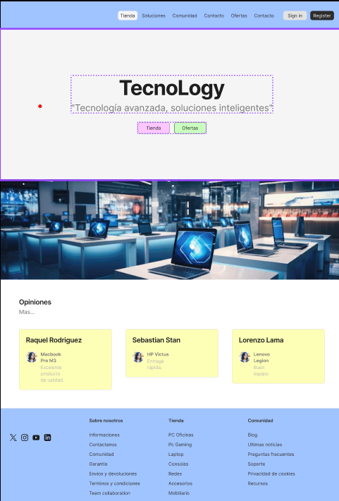
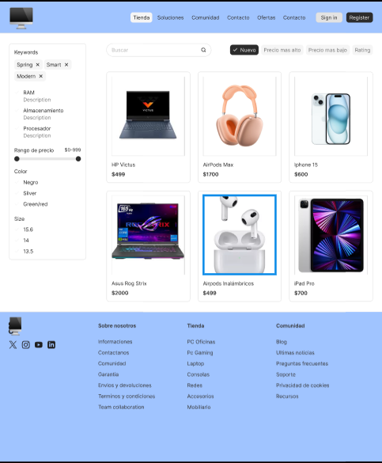
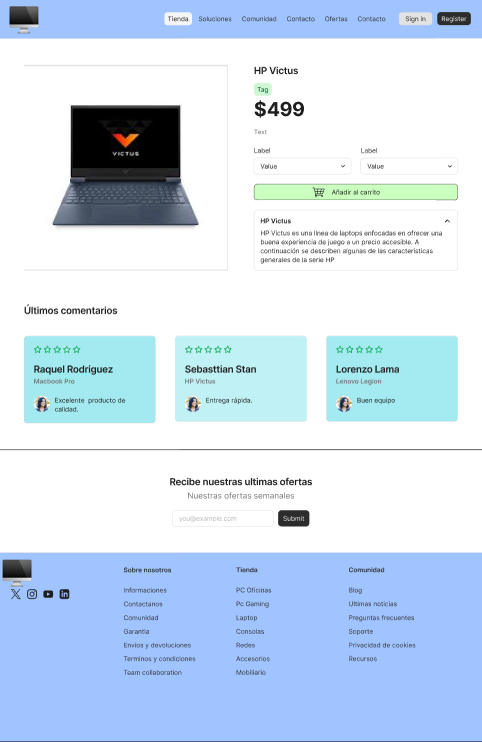

# bit-1
# tecnoLogy

**Tecnología avanzada, soluciones inteligentes**

## Descripción

**tecnoLogy** es una tienda virtual moderna y visualmente atractiva enfocada en la venta de productos tecnológicos como laptops, smartphones, audífonos, relojes inteligentes y más. Su diseño está optimizado para brindar una experiencia clara, dinámica y amigable al usuario.

El sitio web está estructurado con múltiples secciones que permiten navegar fácilmente por la tienda, consultar productos, ofertas y realizar registros e inicios de sesión.

##  Funcionalidades destacadas

-  Página de inicio con slogan y carrusel de productos destacados.
-  Catálogo de productos filtrables.
-  Vista de detalles del producto con imágenes, especificaciones y comentarios.
-  Sección "Sobre nosotros" con información de la marca.
-  Página de contacto y soporte.
-  Sección de ofertas activas.
-  Formularios para registro e inicio de sesión.

##  Autor

- **Nombre**: Yessica Alexandra Conejo Muñoz  
- **GitHub**: [@yessica-222](https://github.com/yessica-222)

##  Enlace al sitio

 [tecnoLogy - Página Web](https://yessica-222.github.io/bit-1/)

##  Capturas de pantalla

> Para mostrar imágenes en tu README, guarda tus capturas en `assets/images/` y usa el siguiente formato:

###  Página de inicio

###  Tienda

###  Detalle del producto

